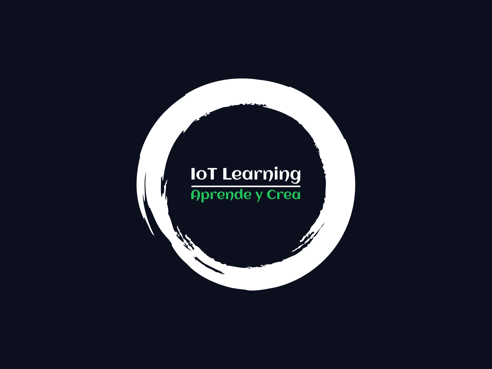

# Blog IoT

## Descripción

**Blog IoT** es una plataforma educativa diseñada para guiar a los usuarios a través del fascinante mundo del Internet de las Cosas (IoT). Desde los conceptos más básicos hasta la implementación de proyectos avanzados, este blog proporciona tutoriales paso a paso para ayudar a los principiantes a convertirse en expertos en IoT. El proyecto principal es "CroqueFeed", un sistema automatizado de alimentación para mascotas.

## Frase de Impacto

"Transforma tu mundo con la magia del IoT: ¡Conecta, crea y controla!"

## Características

- **Tutoriales Paso a Paso**: Guías detalladas desde lo básico hasta proyectos avanzados.
- **Proyecto Principal**: Implementación de "CroqueFeed", un sistema automatizado de alimentación para mascotas.
- **Recursos y Materiales**: Acceso a códigos, diagramas y explicaciones detalladas.
- **Integración con Azure IoT**: Pendiente
## Tecnologías Utilizadas

- **Frontend**:
  - React
  - Vite
  - Tailwind CSS

- **Backend**:
  - Node.js
  - Express.js

- **IoT**:
  - ESP32
  - Sensores ultrasónicos
  - Servomotores

- **Autenticación y Base de Datos**:
  - Firebase

## Estructura del Contenido

### Introducción

- **¿Qué es IoT?**
  - Definición y conceptos básicos.
  - Importancia y aplicaciones en la vida diaria.

### Módulo 1: Fundamentos de IoT

- **Hardware Básico para IoT**
  - Introducción a los microcontroladores (ESP32, Arduino, Raspberry Pi).
  - Sensores y actuadores: ¿qué son y cómo funcionan?
- **Redes y Protocolos de Comunicación**
  - Wi-Fi, Bluetooth y otros protocolos.
  - Configuración de redes locales para dispositivos IoT.

### Módulo 2: Programación de Microcontroladores

- **Configuración del Entorno de Desarrollo**
  - Instalación y configuración del IDE de Arduino.
  - Programación básica con ESP32.
- **Proyectos Iniciales**
  - Control de LEDs con ESP32.
  - Lectura de sensores simples (temperatura, distancia).

### Módulo 3: Desarrollo de Aplicaciones Web

- **Frontend con React y Tailwind CSS**
  - Configuración de un proyecto con Vite.
  - Creación de una interfaz de usuario responsiva.
- **Backend con Node.js y Express.js**
  - Configuración del servidor.
  - Creación de APIs para interactuar con dispositivos IoT.

### Módulo 4: Integración de IoT y Aplicaciones Web

- **Comunicación entre Microcontroladores y Aplicaciones Web**
  - Envío y recepción de datos.
  - Control remoto de dispositivos IoT desde una aplicación web.
- **Proyecto Final: CroqueFeed**
  - Descripción del proyecto y objetivos.
  - Montaje del hardware: ESP32, sensores ultrasónicos, servomotores.
  - Desarrollo de la aplicación web para monitoreo y control.
  - Implementación de notificaciones y seguridad con Firebase.

## Licencia

Este proyecto está bajo la Licencia MIT. Para más detalles, consulta el archivo [LICENSE](LICENSE).

## Contacto

Si tienes alguna pregunta o sugerencia, no dudes en contactar a los desarrolladores:

- Alan Javier Gómez Hernández 

---

¡Gracias por usar **Blog IoT**!
